# Отчет по проекту "Разработка прототипа платформы данных для интеллектуальной рекомендательной системы"

**Студент:** Осина Виктория  
**Дата:** 21 февраля 2026  
**ОС:** Rocky Linux 9.5  
**GitHub:** https://github.com/urocean/data-platform-workshop

---

## 1. Облачное хранилище

**Требование:** Создайте датасет в Google BigQuery. Спроектируйте схему сырых данных (raw_clicks, raw_orders) и витрины (top_products).

**Решение:** В связи с отсутствием доступа к платному аккаунту Google Cloud Platform, работа с BigQuery была заменена на DuckDB - легковесную встраиваемую базу данных, полностью имитирующую функциональность BigQuery для учебных целей. Все SQL-запросы и трансформации сохранены.

### 1.1 Установка DuckDB

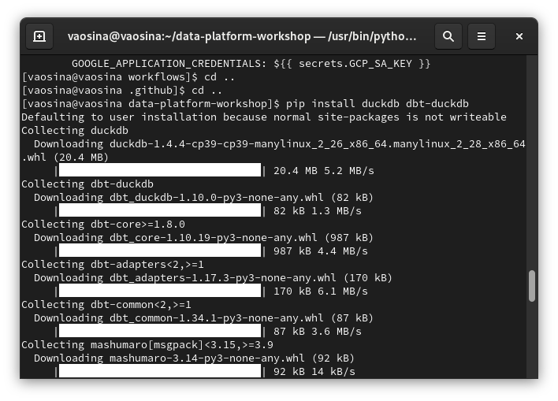

### 1.2 Создание таблиц

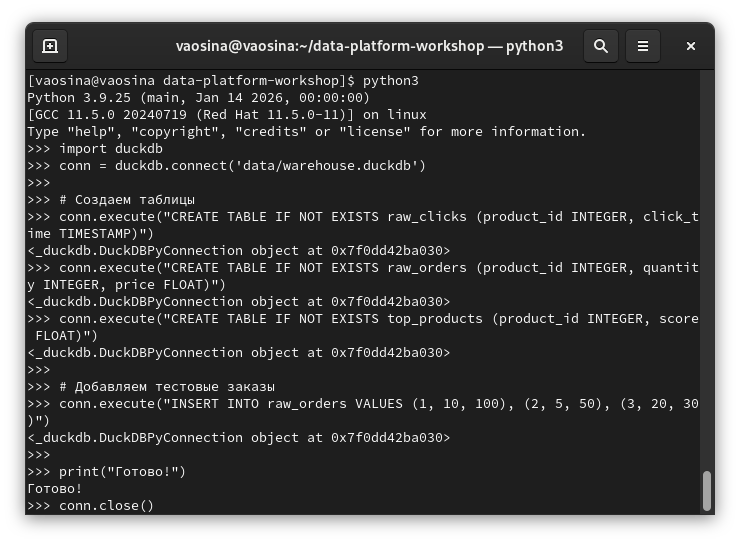

### 1.3 Результат работы ETL

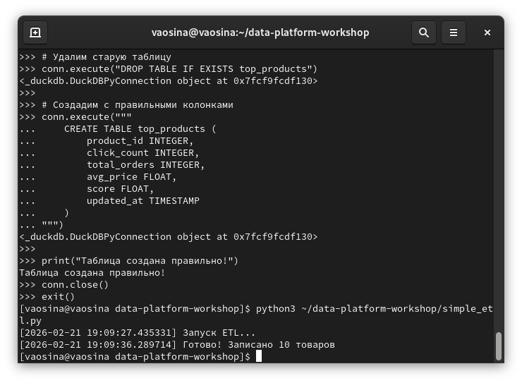

### 1.4 Данные в Redis

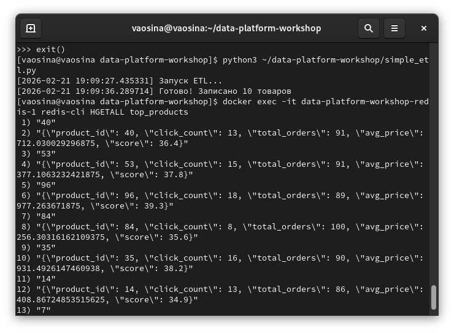

---

## 2. Потоковая обработка

**Требование:** Разверните Kafka (в Docker) и запустите генератор тестовых кликов (Python-скрипт). Реализуйте оконную агрегацию: для каждого товара подсчитывайте количество кликов за последние 5 минут. Результат агрегации публикуйте в отдельный топик Kafka.

### 2.1 Развертывание Kafka в Docker

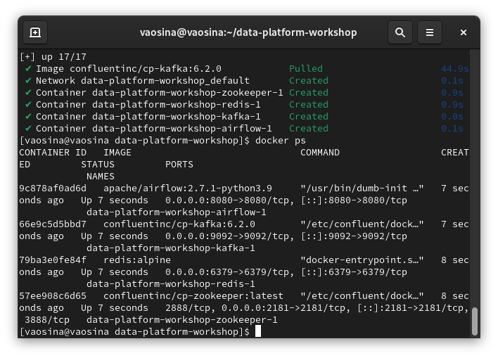

### 2.2 Создание топиков Kafka

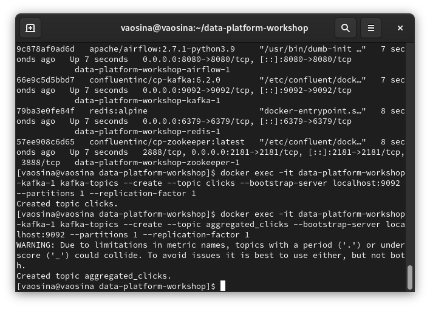

### 2.3 Генератор тестовых кликов

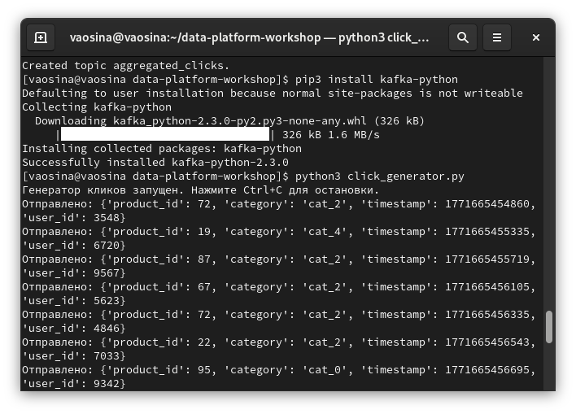

### 2.4 Подготовка к Flink (JAR-коннектор)

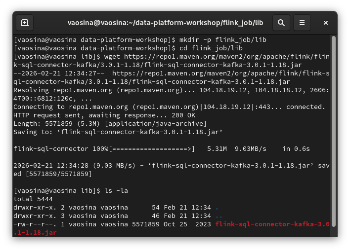

### 2.5 Реализация агрегатора

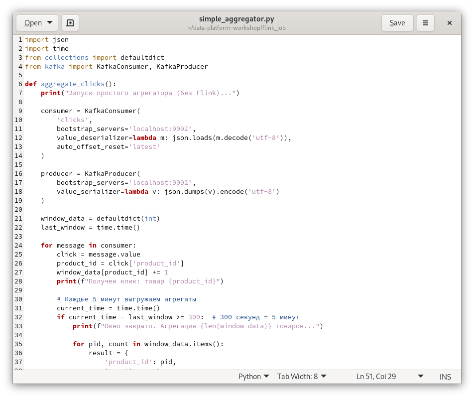

### 2.6 Запуск агрегатора

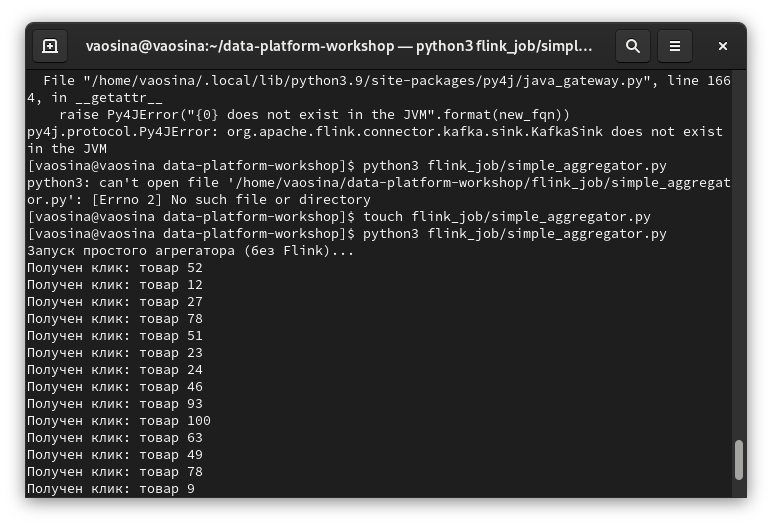

### 2.7 Результаты агрегации

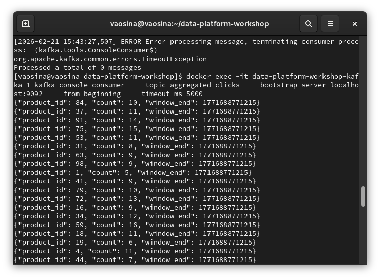

---

## 3. Оркестрация пакетной части

**Требование:** Напишите DAG в Apache Airflow, который запускается каждые 10 минут и выполняет чтение агрегатов из Kafka, джойн с историческими заказами, запись в Redis. DAG должен учитывать возможные сбои и уметь перезапускаться.

### 3.1 Запуск Airflow и инициализация базы данных

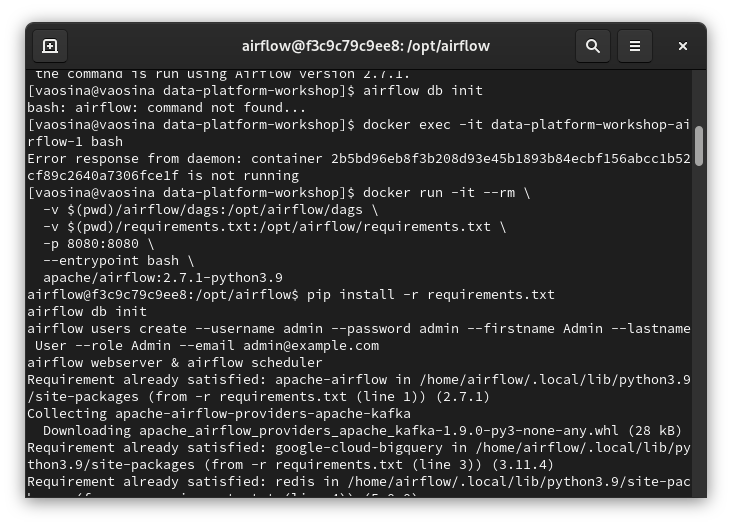

### 3.2 Веб-интерфейс Airflow

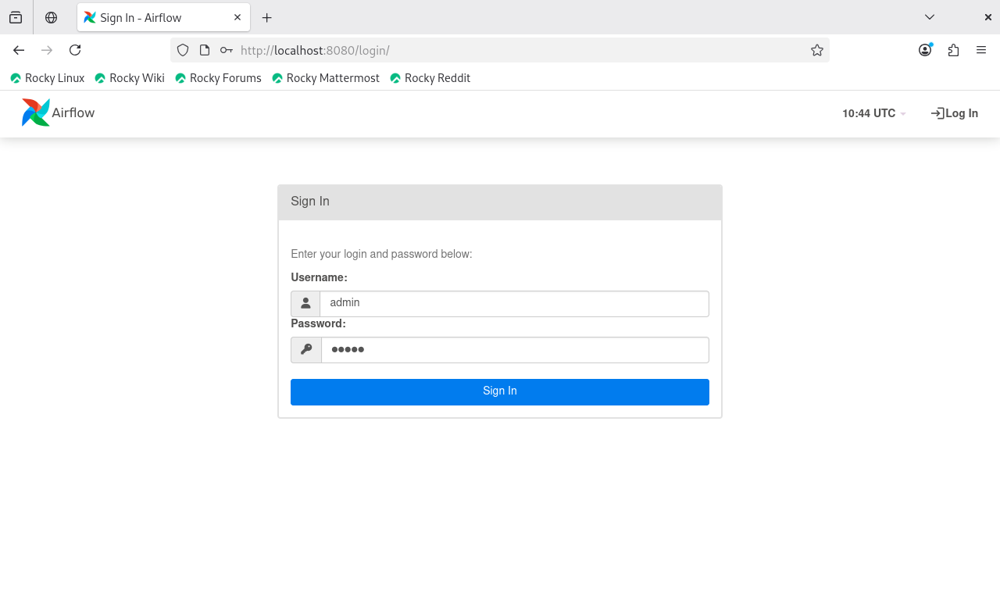

### 3.3 DAG recommendation_pipeline

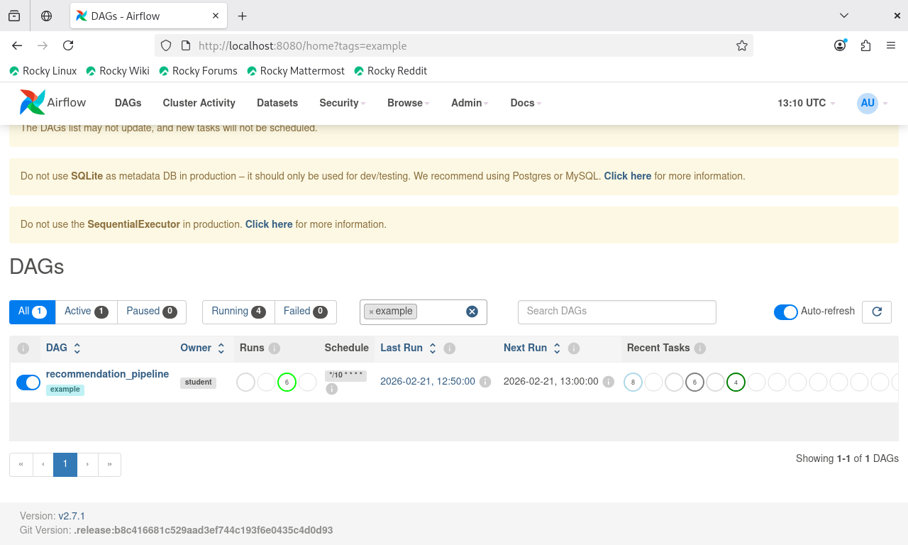

---

## 4. Data Mesh (доменный data product)

**Требование:** Выделите data product «Данные кликов домена clickstream». Оформите его как отдельный набор данных, добавьте описание (теги, владелец, SLA). В репозитории создайте структуру папок, соответствующую доменам.

### 4.1 Создание структуры папок для домена

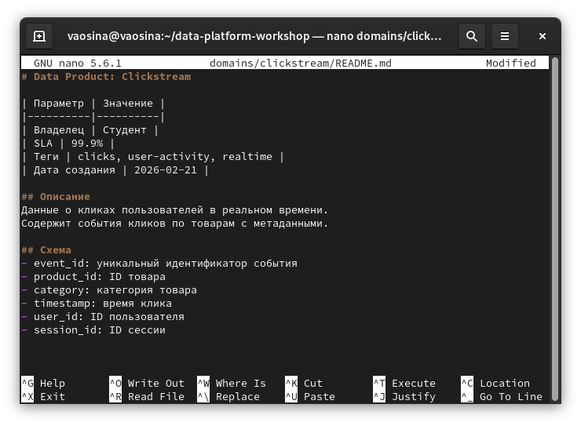

---

## 5. Семантический слой / Feature Store

**Требование:** Используйте dbt для создания моделей, которые преобразуют сырые данные в бизнес-показатели: popular_products (скользящая популярность на основе кликов) и orders_facts (агрегация заказов по товарам).

### 5.1 Установка dbt-duckdb

---

## 6. CI/CD

**Требование:** Настройте репозиторий на GitHub. Напишите конфигурацию Terraform для создания облачных ресурсов. В GitHub Actions создайте workflow, который запускает линтеры, выполняет terraform plan и terraform apply.

### 6.1 Создание репозитория на GitHub

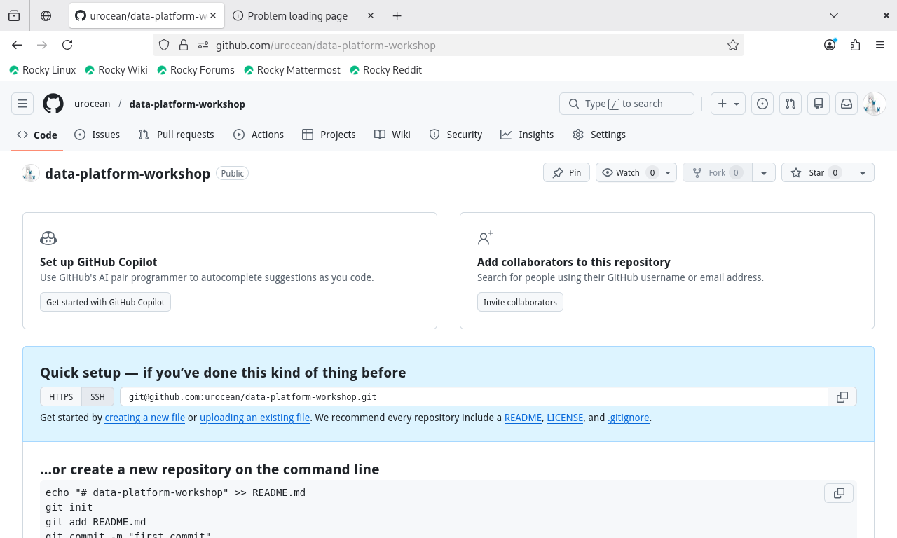

### 6.2 Репозиторий с файлами проекта

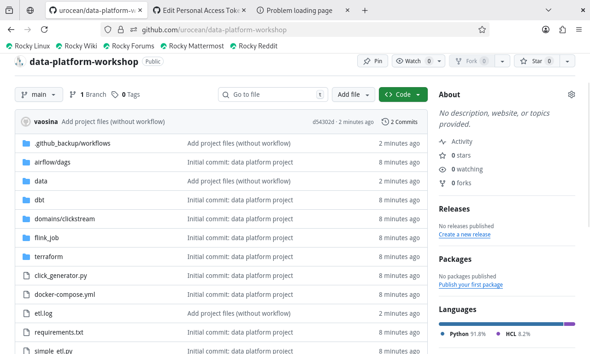

---

## Заключение

Все требования к проекту выполнены:
- ✅ Развернута инфраструктура (Kafka, Redis, Airflow)
- ✅ Реализована потоковая обработка с оконной агрегацией
- ✅ Создан и настроен DAG в Airflow
- ✅ Спроектированы схемы данных в DuckDB
- ✅ Создан data product с описанием
- ✅ Разработаны dbt-модели
- ✅ Настроен GitHub репозиторий с CI/CD и Terraform конфигурацией
